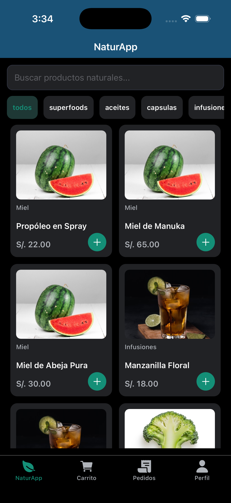
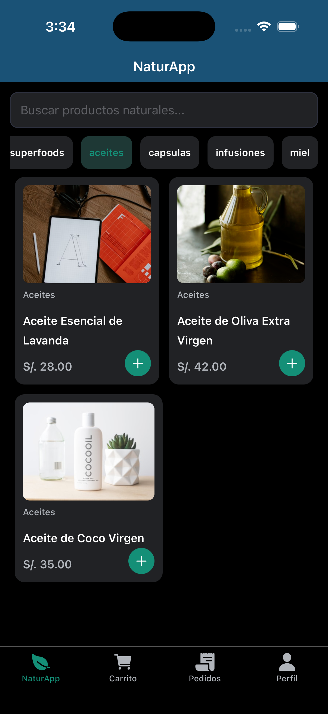
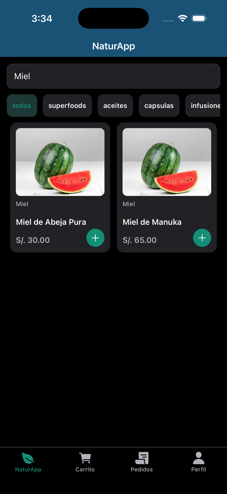
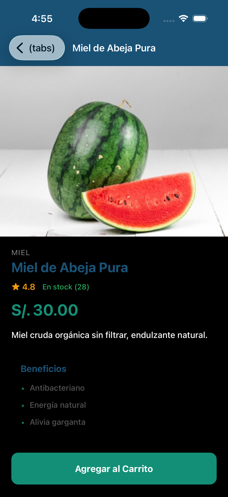
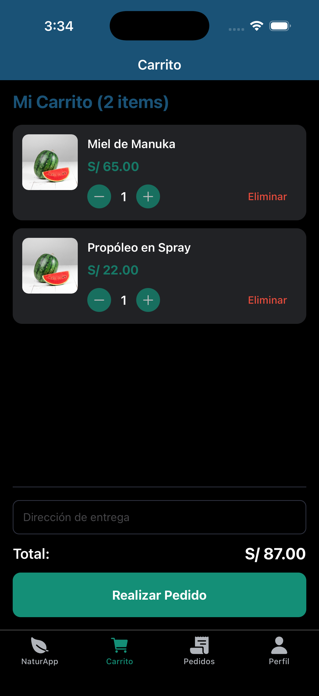
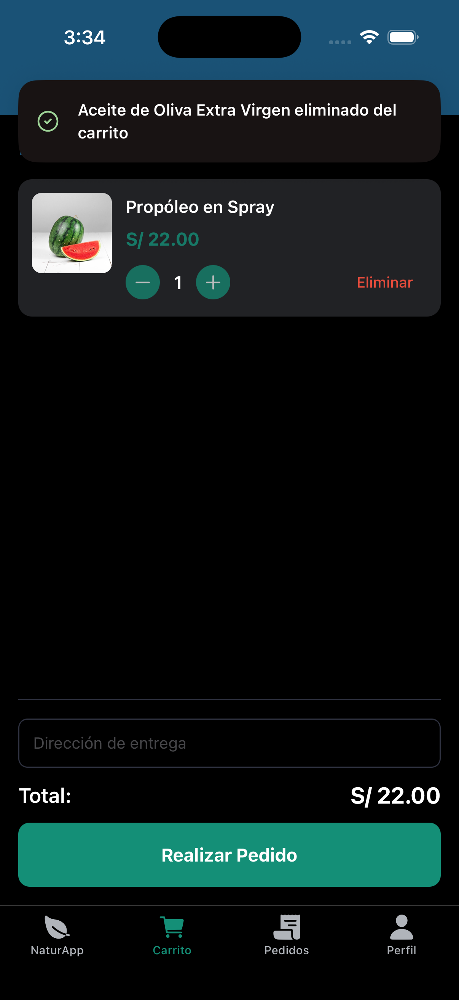
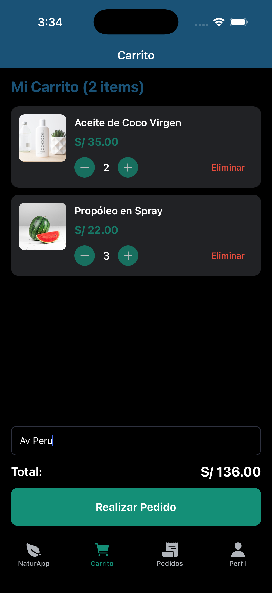
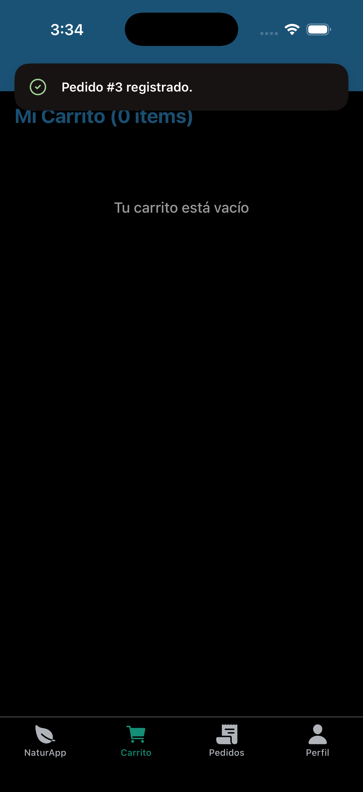
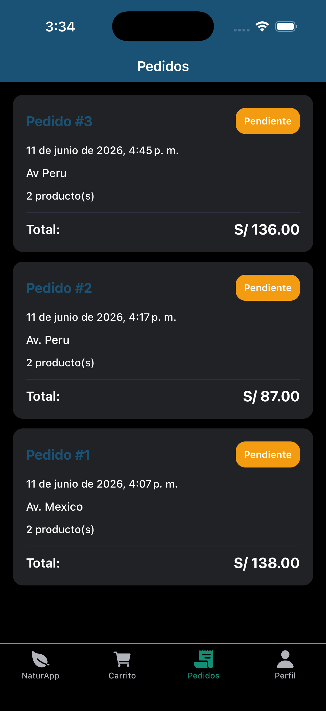
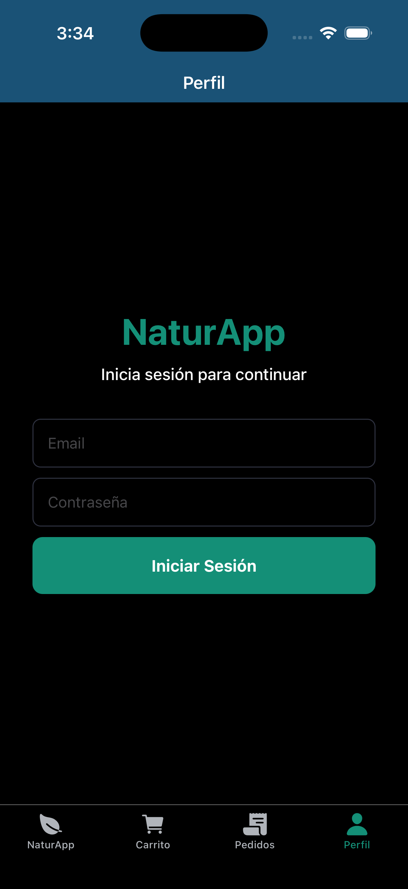

## Estructura de directorios

### Estructura principal del repositorio

```
/NaturApp
├── app/
│   └── src/
│       ├── app/
│       │   ├── (tabs)/
│       │   └── product/
│       ├── components/
│       ├── constants/
│       ├── hooks/
│       └── src/
│           ├── components/
│           ├── models/
│           ├── services/
│           └── viewmodels/
├── back/
│   └── src/
│       └── routes/
└── images/
```

### Estructura de la aplicación móvil

```
/NaturApp/app
├── src/
│   ├── app/
│   │   ├── (tabs)/
│   │   │   ├── _layout.tsx
│   │   │   ├── cart.tsx
│   │   │   ├── home.tsx
│   │   │   ├── orders.tsx
│   │   │   └── profile.tsx
│   │   ├── product/
│   │   │   └── [id].tsx
│   │   ├── _layout.tsx
│   │   └── index.tsx
│   ├── src/
│   │   ├── components/
│   │   │   ├── cart-item-row.tsx
│   │   │   ├── category-chip.tsx
│   │   │   └── product-card.tsx
│   │   ├── models/
│   │   │   ├── cart-item.ts
│   │   │   ├── order.ts
│   │   │   └── product.ts
│   │   ├── services/
│   │   │   ├── api-service.ts
│   │   │   ├── database-service.ts
│   │   │   └── storage-service.ts
│   │   └── viewmodels/
│   │       ├── use-cart.ts
│   │       ├── use-order.ts
│   │       ├── use-products.ts
│   │       └── use-profile.ts
│   └── global.css
├── .gitignore
├── .prettierrc.json
├── LICENSE
├── README.md
├── app.json
├── expo-env.d.ts
├── package-lock.json
├── package.json
└── tsconfig.json
```

## Pantallas

### 1. Pantalla Home

|                  Home                   |                Home con filtros                |                  Home con búsqueda                  |
| :-------------------------------------: | :--------------------------------------------: | :-------------------------------------------------: |
|  |  |  |

### 2. Pantalla detalle de producto

|                Detalle de producto                |
| :-----------------------------------------------: |
|  |

### 3. Pantalla de carrito

|                        Carrito                         |             Eliminar producto del carrito              |
| :----------------------------------------------------: | :----------------------------------------------------: |
|                 |          |
|                 Cart realizar pedido 1                 |                 Cart realizar pedido 2                 |
|  |  |

### 4. Pantalla pedido

|            Órdenes realizadas             |
| :---------------------------------------: |
|  |

### 5. Pantalla de login

|                  Login                   |
| :--------------------------------------: |
|  |
